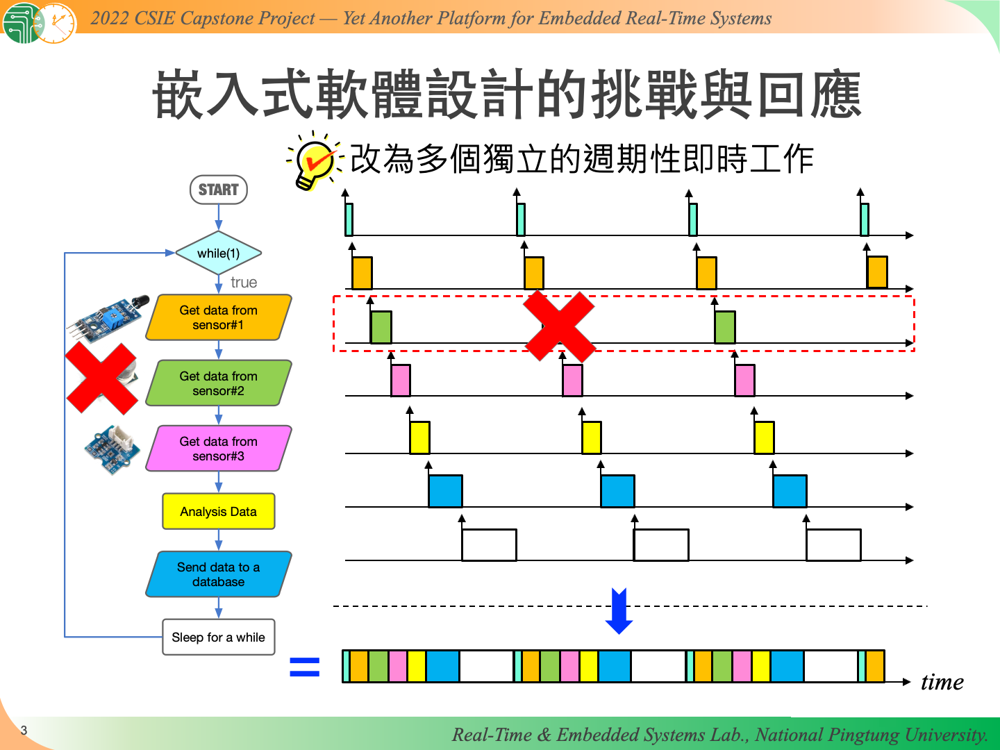

  

- 國立屏東大學 資訊工程學系 111 學年度專題實作
- 2022 年資訊學院專題競賽 智慧系統與雲端應用組 優勝

> [!NOTE]
> 由於專案原始碼過於混亂，故只放上相關文件與圖片

## 簡介

近年來嵌入式軟體的需求呈爆炸性的成⻑，但是在應用開發時，往往需要針對不同的嵌入式硬體開發不同的程式碼，有鑑於此，本專案開發一個嵌入式即時系統開發平台及運行平台―Yapers，實作即時工作排程器與運行不同節能層級的工作版本，並提供 Yapers API 加速工作的開發。考慮現今開發者多以網頁作為使用者介面， Yapers 設計存放於伺服器上的共享資源，以及提供對應的 Yapers Web API 能夠對其進行存取，進一步實現嵌入式軟體與網頁的互動。

## 開發環境

- Raspberry Pi 4B

## 專題文件

[介紹文件](doc/yapers-紙本介紹文件.pdf)

[投影片](doc/yapers-ppt_Intro.pdf)

[功能展示影片(Youtube)](https://youtu.be/-Irm_QJNhcA)

### 海報

### 投影片

## 開發人員

### 專題協作人員

感謝以下人員在開發過程中的幫助！

- 王嘉林
- 黃靖軒

### 專題參與人員

- 王嘉朗
- 郭明穎
- 廖鈞榆 
